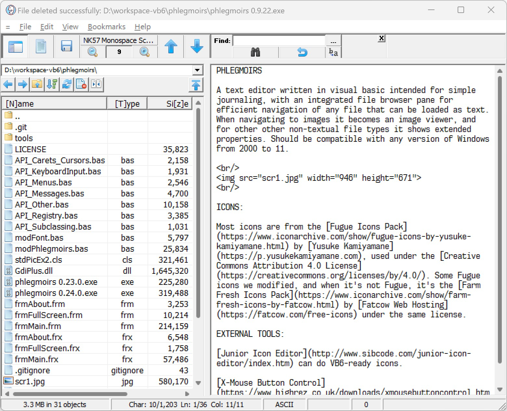

PHLEGMOIRS

A text editor written in visual basic intended for simple journaling, with an integrated file browser pane for efficient navigation of any file that can be loaded as text. When navigating to images it becomes an image viewer, and for other other non-textual file types it shows extended properties. Should be compatible with any version of Windows from 2000 to 11.

 

 

ICONS:

Most icons are from the [Fugue Icons Pack](https://www.iconarchive.com/show/fugue-icons-by-yusuke-kamiyamane.html) by [Yusuke Kamiyamane](https://p.yusukekamiyamane.com), used under the [Creative Commons Attribution 4.0 License](https://creativecommons.org/licenses/by/4.0/). Some Fugue icons we modified, and when it's not Fugue, it's the [Farm Fresh Icons Pack](https://www.iconarchive.com/show/farm-fresh-icons-by-fatcow.html) by [Fatcow Web Hosting](https://fatcow.com/free-icons) under the same license.

EXTERNAL TOOLS:

[Junior Icon Editor](http://www.sibcode.com/junior-icon-editor/index.htm) can do VB6-ready icons.

[X-Mouse Button Control](https://www.highrez.co.uk/downloads/xmousebuttoncontrol.htm) makes the mousewheel function in the VB6 IDE.
